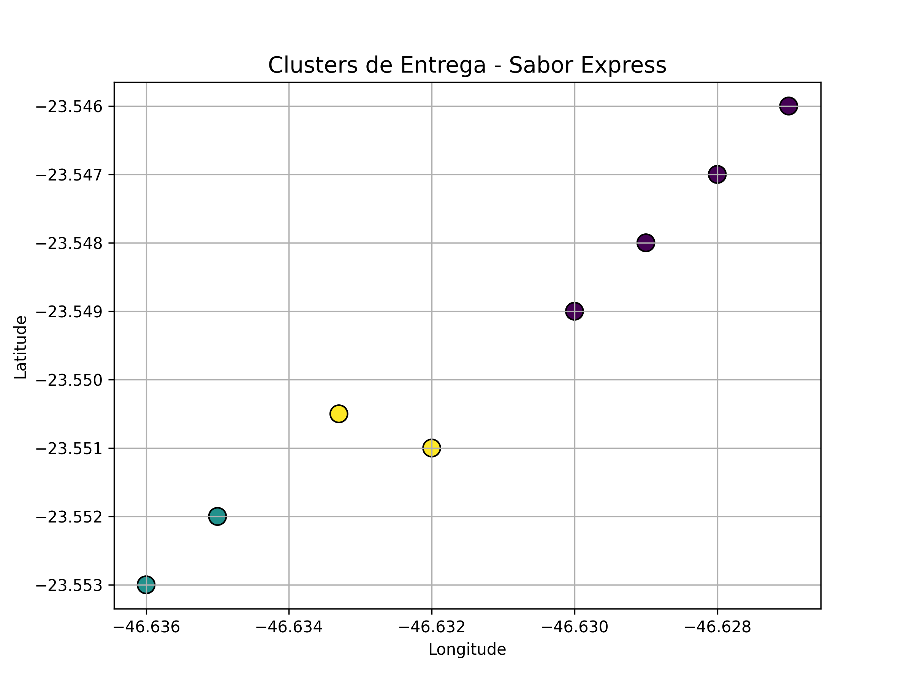

# 🚚 Rota Inteligente — Otimização de Entregas com Inteligência Artificial

## 📖 Descrição do Projeto

Este projeto apresenta um sistema simplificado de **otimização de rotas de entrega utilizando Inteligência Artificial**.

A aplicação simula o funcionamento de uma empresa fictícia de entregas chamada **Sabor Express**, cujo objetivo é melhorar a eficiência logística ao:

- Agrupar entregas geograficamente próximas
- Calcular a melhor rota de entrega

Para isso, foram utilizados dois conceitos fundamentais da área de **Inteligência Artificial e Ciência de Dados**:

- Clustering com **K-Means**
- Busca heurística com **algoritmo A\***

---

# 🎯 Objetivos do Projeto

O projeto tem como principais objetivos:

- Aplicar conceitos básicos de **Inteligência Artificial**
- Implementar **algoritmos de agrupamento e busca**
- Simular um cenário real de **otimização logística**
- Organizar um projeto de software utilizando **boas práticas de repositório no GitHub**

---

# 🧠 Algoritmos Utilizados

## 1️⃣ Clustering — K-Means

O algoritmo **K-Means** foi utilizado para **agrupar entregas próximas geograficamente**.

Benefícios:

- Redução da distância percorrida
- Melhor organização das rotas
- Possibilidade de divisão entre múltiplos entregadores

Biblioteca utilizada:

scikit-learn

---

## 2️⃣ Busca Heurística — A*

O algoritmo **A\*** foi utilizado para calcular **a melhor rota entre o restaurante e o cliente final**.

Características:

- Algoritmo clássico de busca em grafos
- Utiliza heurística para encontrar o caminho mais eficiente
- Muito utilizado em sistemas de navegação e logística

Biblioteca utilizada:

networkx

---

# 📁 Estrutura do Projeto

delivery-ai-project
│
├── data
│
├── src
│   clustering.py
│   route_optimization.py
│   map_visualization.py
│   main.py
│
├── outputs
│   clusters.png
│   mapa_rota.html
│
├── requirements.txt
└── README.md

---

# ⚙️ Funcionamento do Sistema

Fluxo do sistema:

Dados de entregas (CSV)
↓
Clusterização com K-Means
↓
Agrupamento de entregas próximas
↓
Construção do grafo de rotas
↓
Cálculo da melhor rota com A*
↓
Exibição do resultado

---

# 📊 Base de Dados

O arquivo:

data/entregas.csv

contém os pontos de entrega representados por:

- Latitude
- Longitude

Exemplo:

pedido,latitude,longitude
1,-23.5505,-46.6333
2,-23.5510,-46.6320
3,-23.5490,-46.6300

---

# ▶️ Como Executar o Projeto

### 1️⃣ Clonar o repositório

git clone https://github.com/vivianduarteribeiro/delivery-ai-project.git

### 2️⃣ Acessar a pasta do projeto

cd delivery-ai-project

### 3️⃣ Instalar as dependências

pip install -r requirements.txt

### 4️⃣ Executar o sistema

python src/main.py

---

## Resultado do Clustering

## Visualização da Rota

Abra o arquivo:

outputs/mapa_rota.html

para visualizar o mapa interativo com a rota de entrega.

# 📈 Resultados

Ao executar o sistema:

- As entregas são agrupadas em **clusters**
- Um **gráfico é gerado automaticamente**
- O **melhor caminho de entrega é calculado**

Arquivo gerado:

outputs/clusters.png

---

# 🛠 Tecnologias Utilizadas

- Python
- Pandas
- Scikit-Learn
- Matplotlib
- NetworkX
- Git
- GitHub

---

# 📚 Conceitos de IA Aplicados

Este projeto aplica conceitos fundamentais de:

- Machine Learning
- Clustering
- Busca heurística
- Otimização logística
- Modelagem de grafos